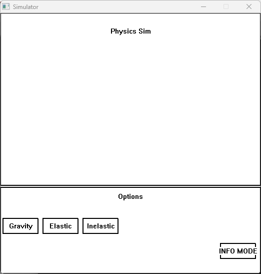

# Professor: Alam Z.
# Student: Larry S.

#Project 1: Interactive Physics Simulation Program

The current window simulates 3 phenomenon: Gravity between objects, ellastic and inellastic collisions.

To Run:
1. Locate Main.exe inside of Part1/Main.exe. There will be 2 other files named Button.* and Window.*.
2. Running Main.exe will open up the physics simulation window which will be split into 2 parts.

    
click to expand

    
  

