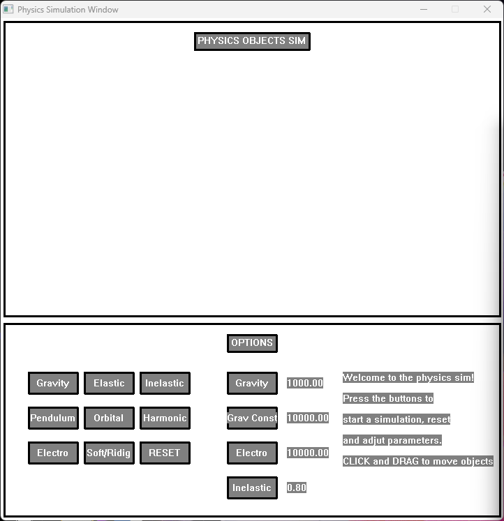

Professor: Alam Z.
Class: C++ Course
Student: Larry S.

## Project 1: Interactive Physics Simulation Program

```
Hello
```

To Run:
Running Main.exe will open up the physics simulation.

You are able to press the simulation buttons, reset, change parameters and interact via clicking and dragging the obecjts.

When inputting, to cancle press escape - "esc" and enter to commit the change.

<details>
    <summary>Show Main Window</summary>
    
</details>
