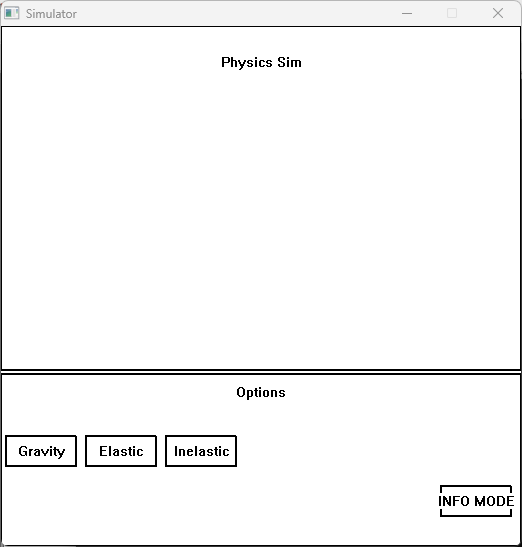

Professor: Alam Z.
Class: C++ Course
Student: Larry S.

## Project 1: Interactive Physics Simulation Program

The current window simulates 3 phenomenon: Gravity between objects, ellastic and inellastic collisions.

To Run:
Running Main.exe will open up the physics simulation window which will be split into 2 parts.

    
Show Main Window

    

3. Hovering on the buttons will fade them slightly to show the user that they are interactable. Upon clicking, the simulation will reset to whatever option is choosen. The INFO MODE button is currently not working.
4. Once a simulation has been started the user is able to click on the circles to get information such as: mass, charge, position, velocity, and acceleration. The user is also able to click and drag to move the circles around by adding velocity to them.
